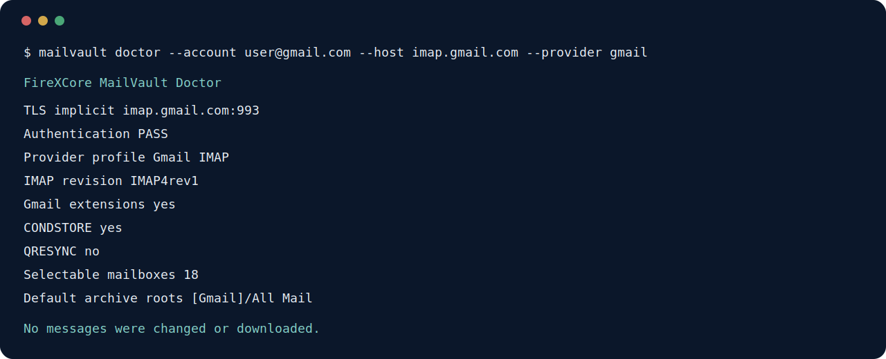
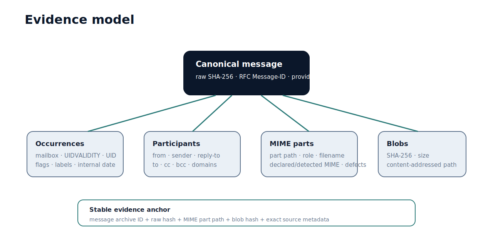

<p align="center">
  
</p>

<p align="center">
  <a href="https://github.com/FireXCore/mailvault/actions/workflows/ci.yml"></a>
  <a href="https://www.python.org/"></a>
  <a href="LICENSE"></a>
  <a href="https://github.com/FireXCore/mailvault/security"></a>
</p>

<p align="center">
  <a href="docs/README.fa.md">راهنمای فارسی</a> ·
  <a href="docs/GETTING_STARTED.md">Getting started</a> ·
  <a href="docs/RESUMABLE_VIEWS.md">Resumable views</a> ·
  <a href="docs/ARCHITECTURE.md">Architecture</a> ·
  <a href="docs/PROCUREMENT_READINESS.md">Procurement readiness</a>
</p>

FireXCore MailVault is a provider-neutral, read-only email evidence archiver. It acquires complete messages through IMAP, preserves immutable raw EML objects, records every MIME part and mailbox occurrence, deduplicates attachment content by SHA-256, and produces traceable manifests for analytics, eDiscovery, migration staging, and procurement intelligence.

MailVault is not an attachment downloader. The canonical unit is the complete email message, including headers, bodies, MIME structure, inline resources, nested messages, signatures, encrypted containers, attachment occurrences, provider identifiers, mailbox identifiers, labels, flags, and timestamps.

## Project status

MailVault is in public beta. The archive model and read-only acquisition guarantees are stable. Provider adapters beyond Gmail and generic IMAP, including OAuth-based Microsoft 365 and JMAP, are planned as separate milestones.

## Design objectives

- Preserve raw evidence before deriving metadata.
- Keep provider-specific behavior outside the archive domain.
- Use stable provider identifiers where available and standards-based fallbacks elsewhere.
- Store duplicate payloads once without losing any message occurrence.
- Make every derived record reproducible from canonical raw objects.
- Avoid IMAP mutation operations entirely.
- Never persist passwords or App Passwords.
- Expose exact evidence anchors for downstream procurement facts.

## Architecture

<p align="center">
  
</p>

The archive is split into four concerns:

1. **Acquisition** negotiates IMAP capabilities and fetches messages using UID-based, read-only operations.
2. **Canonical evidence** stores immutable raw EML and content-addressed non-body MIME payloads.
3. **Operational metadata** records provider identities, mailbox occurrences, participants, headers, MIME parts, hashes, defects, and sync state in SQLite.
4. **Derived outputs** generate portable JSON/JSONL manifests, navigation views, and procurement source anchors.

See [Architecture](docs/ARCHITECTURE.md) and [Data model](docs/DATA_MODEL.md).

## Core guarantees

MailVault provides the following engineering guarantees:

1. Raw messages are stored byte-for-byte as immutable EML objects.
2. Raw acquisition uses read-only mailbox selection and `BODY.PEEK[]`; MailVault contains no delete, move, copy, append, send, flag-mutation, or label-mutation command.
3. Every MIME part is classified and retained as a body, inline resource, attachment, nested message, digital-signature artifact, encrypted container, TNEF container, or unresolved part.
4. Attachment identity is based on SHA-256 content, not filename. Duplicate bytes share one stored object while each email occurrence remains recorded.
5. Mailbox occurrence is distinct from canonical message identity, preventing Gmail labels or multi-mailbox copies from being double-counted.
6. Malformed Unicode is repaired only in derived metadata. The original message bytes remain unchanged.
7. Derived per-message JSON, JSONL manifests, and navigation views can be deleted and regenerated.
8. Each procurement source record points back to a canonical message, MIME part, blob hash, and storage path.

MailVault does not claim that every damaged, encrypted, malformed, or visually unreadable document can be interpreted automatically. Such sources are preserved without inventing content.

## Supported connections

| Provider profile | Authentication | Provider metadata | Status |
|---|---|---|---|
| Gmail IMAP | App Password | `X-GM-MSGID`, `X-GM-THRID`, `X-GM-LABELS`, `X-GM-RAW` | Supported |
| Generic IMAP | Password or App Password | UID, UIDVALIDITY, RFC headers; OBJECTID when advertised | Supported |
| Microsoft 365 | OAuth 2.0 | Exchange/Graph-specific identifiers | Planned adapter |
| JMAP | Provider-dependent | Email, Thread, Blob and Mailbox identifiers | Planned adapter |

Generic IMAP is suitable for standards-compatible servers including Dovecot, Courier, cPanel, Plesk, Zimbra, DirectAdmin, and many hosted domain-email services. Server behavior is discovered through IMAP capability negotiation rather than assumed from the hostname.

## Installation

### Recommended for a source checkout: pipx

```bash
pipx install .
```

After an official PyPI release is published, the package can also be installed by name:

```bash
pipx install firexcore-mailvault
```

### Virtual environment

Windows PowerShell:

```powershell
py -3.13 -m venv .venv
.\.venv\Scripts\Activate.ps1
python -m pip install --upgrade pip
python -m pip install -e .
```

Linux and macOS:

```bash
python3 -m venv .venv
source .venv/bin/activate
python -m pip install --upgrade pip
python -m pip install -e .
```

Verify the installation:

```bash
mailvault version
python -m firexcore_mailvault version
```

Both commands read the version from installed distribution metadata and must return the same value.

## Quick start

### Gmail with an App Password

Validate TLS, authentication, capabilities, and mailbox discovery without downloading messages:

```powershell
mailvault doctor `
  --account user@gmail.com `
  --host imap.gmail.com `
  --provider gmail `
  --auth app-password
```

Archive the complete mailbox:

```powershell
mailvault sync `
  --account user@gmail.com `
  --host imap.gmail.com `
  --provider gmail `
  --auth app-password `
  --destination E:\MailVault `
  --scope all `
  --soft-cap 1GiB `
  --hard-cap 1.25GiB
```

The App Password is requested through hidden terminal input. It is not written to configuration, SQLite, JSON, manifests, reports, or logs.

After a full Gmail sync, verify remote label coverage before treating the archive as final:

```powershell
mailvault audit-labels `
  --account user@gmail.com `
  --host imap.gmail.com `
  --destination E:\MailVault
```

Full-scope Gmail sync performs this reconciliation automatically before it can report `complete`. The standalone command can be rerun at any time and writes a JSON report under `reports/`.

<p align="center">
  
</p>

### Domain-hosted email through generic IMAP

```powershell
mailvault doctor `
  --account procurement@example.com `
  --host mail.example.com `
  --port 993 `
  --provider generic-imap `
  --auth password
```

```powershell
mailvault sync `
  --account procurement@example.com `
  --host mail.example.com `
  --port 993 `
  --provider generic-imap `
  --auth password `
  --destination E:\MailVault `
  --scope all
```

Use STARTTLS on port 143 only when the provider explicitly requires it:

```text
--tls-mode starttls --port 143
```

## Configuration file

Copy the example configuration and edit non-secret settings:

```powershell
Copy-Item config.example.toml config.toml
mailvault sync --config .\config.toml
```

Passwords must not be placed in TOML. MailVault accepts hidden terminal input or a process-scoped `MAILVAULT_SECRET` environment variable for controlled automation.

See [Configuration](docs/CONFIGURATION.md).

## Commands

| Command | Purpose |
|---|---|
| `mailvault doctor` | Validate TLS, authentication, server capabilities, provider profile, and mailbox discovery. |
| `mailvault sync` | Discover metadata and archive complete raw messages with resumable state. |
| `mailvault audit-labels` | Compare every IMAP-visible Gmail label with locally archived raw EML identities. |
| `mailvault stats` | Display message, occurrence, MIME-part, blob, and storage counts. |
| `mailvault verify` | Recalculate raw-message and blob hashes. |
| `mailvault export` | Regenerate portable JSONL and procurement source manifests. |
| `mailvault views` | Build resumable navigation views with exact progress, ETA, transactional publication, and automatic checkpoint recovery. |
| `mailvault version` | Print the installed distribution version. |

See [CLI reference](docs/CLI_REFERENCE.md).

## Windows-safe, resumable navigation views

MailVault 2.0.6 hardens the derived navigation-view pipeline for large archives:

1. **Windows-safe paths** — untrusted labels, sender addresses, thread identifiers, and attachment filenames cannot create unbounded view paths. Directory segments and pointer filenames are bounded and receive deterministic SHA-256 suffixes when required.
2. **Durable resume** — completed source rows are checkpointed into a staging build. After `Ctrl+C`, rerunning the same command resumes from the last durable cursor instead of deleting all completed work.
3. **Exact progress and ETA** — the command plans the complete source snapshot, calculates exact source-row and pointer totals, and displays planning, building, resuming, publishing, percentage, and estimated time remaining.

<p align="center">
  
</p>

```powershell
mailvault views `
  --destination "E:\MailVault-E"
```

Use `--restart` only to intentionally discard an incomplete staging build. The previous completed `views/` tree remains available until its replacement is fully written and transactionally published.

See [Resumable navigation views](docs/RESUMABLE_VIEWS.md) for the lifecycle, state files, path-safety model, recovery behavior, operational checks, and validation commands.

## Archive layout

```text
MailVault/
├── objects/
│   ├── raw/sha256/          immutable raw EML objects
│   └── blobs/sha256/        immutable non-body MIME payloads
├── metadata/messages/       derived per-message JSON
├── database/mailvault.sqlite3
├── manifests/
│   ├── messages.jsonl
│   ├── message_occurrences.jsonl
│   ├── message_parts.jsonl
│   ├── blobs.jsonl
│   └── procurement_sources.jsonl
├── state/                   checkpoints, locks and bandwidth ledger
├── reports/                 run and integrity reports
├── logs/                    structured operational logs
└── views/                   disposable navigation pointers
```

The canonical archive consists of immutable objects plus the SQLite database. Metadata JSON, manifests, reports, and views are derived outputs.

See [Archive format](docs/ARCHIVE_FORMAT.md).

## Evidence model

<p align="center">
  
</p>

The data model separates canonical message identity from mailbox occurrences. This distinction is required for Gmail label semantics, generic IMAP folders, message moves, provider deduplication, and accurate downstream response metrics.

## Procurement intelligence readiness

`manifests/procurement_sources.jsonl` contains an evidence record for every usable message body and MIME part. Records include:

- canonical message archive ID;
- raw EML SHA-256 and object path;
- provider message and thread identities;
- RFC `Message-ID`, `In-Reply-To`, and `References` evidence;
- sender, recipients, domains, subject, dates, mailbox, labels, and flags;
- MIME part path, role, original filename, declared/detected MIME type, SHA-256, and blob path.

This contract preserves the information required to build:

- supplier identity and contact history;
- RFQ, inquiry, quotation, purchase order, invoice, shipping, and payment relationships;
- supplier response rate and response latency;
- quotation completeness and commercial deviation;
- price history with currency, quantity, UOM, date, validity, freight, payment terms, and Incoterm context;
- requested versus offered product identities;
- technical substitution proposals, differences, approvals, rejections, and source evidence;
- delivery and lead-time history;
- document and certificate provenance.

MailVault does not infer procurement facts inside the archive core. It preserves evidence so a separate, versioned procurement extraction layer can produce facts with confidence, extractor version, and exact citations.

See [Procurement readiness](docs/PROCUREMENT_READINESS.md).

## Security and privacy

Mail content is untrusted input. MailVault treats filenames, MIME headers, charsets, HTML, nesting, attachment bytes, and server responses as hostile data.

Implemented controls include:

- TLS certificate validation;
- hidden credential input;
- no credential persistence;
- content-addressed object paths independent of attachment filenames;
- filename sanitization only in disposable views;
- atomic writes and SHA-256 verification;
- SQLite transactions and foreign keys;
- single-run locking;
- read-only IMAP acquisition;
- no attachment execution or rendering;
- structured logs without raw message bodies or secrets.

Review [Security policy](SECURITY.md) and [Security model](docs/SECURITY_MODEL.md) before deploying MailVault against sensitive mailboxes.

## Reliability and operational limits

MailVault uses metadata-first discovery, bounded fetch batches, randomized delays, rolling 24-hour bandwidth caps, checkpointed resume, and exponential retry. Provider limits still apply. Sync and navigation-view builds can be safely stopped and restarted with the same command and destination. View builds display exact source-row progress and ETA, write into a resumable staging tree, and publish only after the replacement snapshot is complete.

Before transferring or importing an archive, run:

```bash
mailvault verify --destination /path/to/MailVault
```

See [Operations](docs/OPERATIONS.md) and [Troubleshooting](docs/TROUBLESHOOTING.md).

## Development

```bash
python -m venv .venv
source .venv/bin/activate
python -m pip install -e '.[dev]'
python scripts/quality.py
```

The quality gate runs Ruff linting and formatting checks, strict mypy, pytest with coverage, package build, wheel metadata validation, and CLI smoke tests.

See [Contributing](CONTRIBUTING.md) and [Development](docs/DEVELOPMENT.md).

## Documentation

- [Getting started](docs/GETTING_STARTED.md)
- [Configuration](docs/CONFIGURATION.md)
- [CLI reference](docs/CLI_REFERENCE.md)
- [Resumable navigation views](docs/RESUMABLE_VIEWS.md)
- [Provider support](docs/PROVIDERS.md)
- [Architecture](docs/ARCHITECTURE.md)
- [Archive format](docs/ARCHIVE_FORMAT.md)
- [Data model](docs/DATA_MODEL.md)
- [Security model](docs/SECURITY_MODEL.md)
- [Operations](docs/OPERATIONS.md)
- [Troubleshooting](docs/TROUBLESHOOTING.md)
- [Procurement readiness](docs/PROCUREMENT_READINESS.md)
- [Repository setup](docs/REPOSITORY_SETUP.md)
- [Roadmap](docs/ROADMAP.md)
- [References](docs/REFERENCES.md)
- [Release notes: 2.0.6](docs/releases/v2.0.6.md)

## License

FireXCore MailVault is licensed under the Apache License 2.0. See [LICENSE](LICENSE) and [NOTICE](NOTICE).
