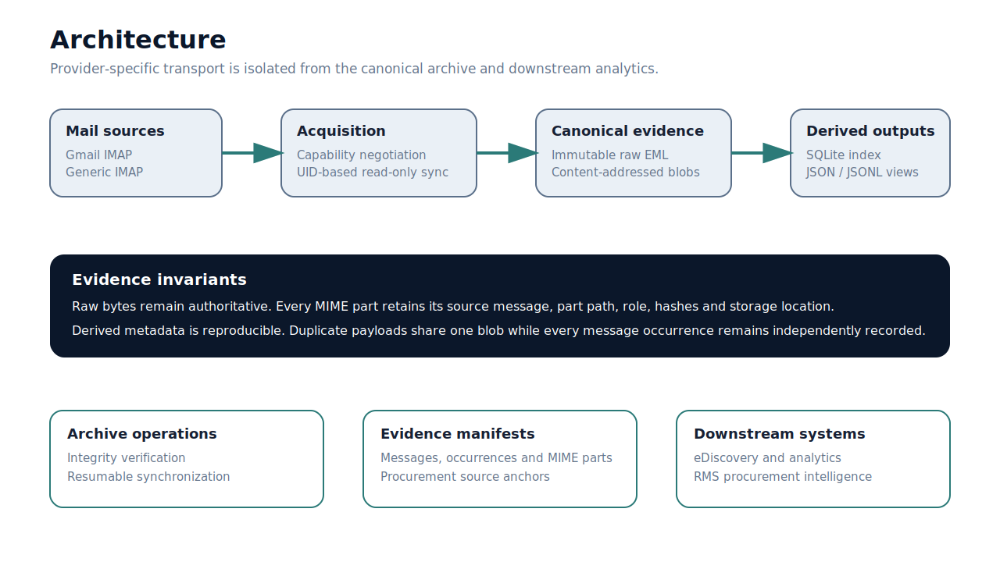

# Architecture

<p align="center">
  
</p>

## Boundaries

MailVault separates transport, provider semantics, canonical evidence, operational indexing, and derived exports.

```text
protocols/imap       IMAP transport and capability parsing
providers/           Gmail and generic provider semantics
archive/             content-addressed immutable storage
repository.py        SQLite schema and transactions
mime_parser.py       MIME decomposition and evidence roles
sync_engine.py       metadata discovery and pending raw acquisition
exporter.py          portable JSONL regeneration
procurement/         domain-neutral procurement source manifest
view_exporter.py     disposable human-navigation pointers
```

## Acquisition sequence

1. Establish TLS and authenticate.
2. Read server capabilities.
3. Select a provider profile.
4. Discover archive mailboxes.
5. Record mailbox generation and UIDVALIDITY.
6. Fetch metadata in bounded UID batches.
7. Upsert canonical message candidates and mailbox occurrences.
8. Fetch raw bytes only for unresolved canonical messages.
9. Store raw EML by SHA-256.
10. Parse MIME locally and store unique non-body payloads by SHA-256.
11. Commit message, occurrences, participants, parts and blob relations transactionally.
12. Regenerate configured derived outputs.

## Canonical versus derived data

Canonical:

- raw EML objects;
- blob objects;
- SQLite message, occurrence, participant, MIME-part and object relations.

Derived:

- per-message JSON;
- JSONL manifests;
- procurement source manifests;
- navigation views;
- reports.

Derived outputs can be removed and regenerated without contacting the mail server.

## Identity strategy

Provider identities are preserved, not normalized away.

Priority examples:

- Gmail: `X-GM-MSGID` and `X-GM-THRID`;
- OBJECTID-capable server: `EMAILID` and `THREADID`;
- generic fallback: account, mailbox generation, UID, RFC Message-ID and raw SHA-256 evidence.

No single RFC Message-ID is assumed to be globally unique or always present.

## Write safety

Object writes use a temporary file, flush, `fsync`, permission hardening where supported, atomic replacement and directory synchronization on POSIX.

SQLite uses explicit transactions, foreign keys and WAL mode. A run lock prevents concurrent writers against the same archive.

## Unicode safety

Raw bytes remain untouched. Derived text passes through a Unicode sanitizer that:

- converts valid surrogate pairs;
- recovers reversible surrogate-escaped UTF-8 where possible;
- replaces unpaired invalid surrogates in metadata only.

This protects JSON and SQLite without corrupting the forensic source.

## Extension strategy

New providers implement the provider profile contract. New protocols should map their native identities and occurrences into the canonical model without changing archive object semantics.

Procurement extraction, OCR, VLM processing, supplier resolution and price normalization must remain downstream plugins. They must cite MailVault evidence anchors rather than modifying archive data.
