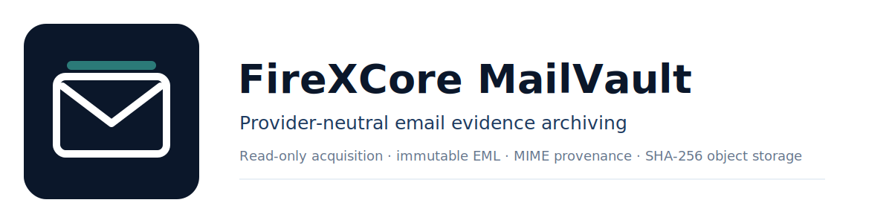

<p align="center">
  
</p>

# راهنمای فارسی FireXCore MailVault

FireXCore MailVault یک موتور آرشیو شواهد ایمیل است که به‌صورت فقط‌خواندنی از IMAP استفاده می‌کند. این پروژه پیام کامل را به‌عنوان منبع اصلی نگه می‌دارد، نه فقط فایل‌های پیوست را. هر پیام به‌صورت EML خام و تغییرناپذیر ذخیره می‌شود؛ تمام بخش‌های MIME، فرستنده‌ها، گیرنده‌ها، شناسه‌های Provider، پوشه‌ها، Labelها، Flagها، تاریخ‌ها و پیوست‌ها نیز با مسیر شواهد دقیق ثبت می‌شوند.

## وضعیت پروژه

نسخه فعلی Beta عمومی است. هسته آرشیو، مدل شواهد و اتصال Gmail/Generic IMAP آماده استفاده‌اند. اتصال OAuth برای Microsoft 365 و Adapter مربوط به JMAP در Roadmap قرار دارند.

## اصول طراحی

- ابتدا شواهد خام ذخیره می‌شوند و سپس Metadata مشتق می‌شود.
- فایل EML منبع حقیقت است و هیچ Parser یا مدل آن را تغییر نمی‌دهد.
- Provider-specific logic از هسته آرشیو جدا است.
- فایل‌های تکراری با SHA-256 یک بار ذخیره می‌شوند، اما تمام رخدادهای آن‌ها در ایمیل‌های مختلف حفظ می‌شود.
- هیچ Password یا App Password در فایل تنظیمات، دیتابیس، JSON یا Log ذخیره نمی‌شود.
- عملیات حذف، انتقال، تغییر Flag، تغییر Label، ارسال یا Append در پروژه وجود ندارد.
- تمام خروجی‌های مشتق‌شده قابل بازسازی از EML و SQLite هستند.
- برای هر منبع قابل استفاده در Procurement یک Evidence Anchor دقیق تولید می‌شود.

## نصب در Windows

```powershell
py -3.13 -m venv .venv
.\.venv\Scripts\Activate.ps1
python -m pip install --upgrade pip
python -m pip install -e .
```

بررسی نسخه:

```powershell
mailvault version
python -m firexcore_mailvault version
```

هر دو دستور باید یک نسخه یکسان نمایش دهند.

## اتصال Gmail با App Password

ابتدا اتصال را بدون دانلود پیام بررسی کن:

```powershell
mailvault doctor `
  --account user@gmail.com `
  --host imap.gmail.com `
  --provider gmail `
  --auth app-password
```

استخراج کامل:

```powershell
mailvault sync `
  --account user@gmail.com `
  --host imap.gmail.com `
  --provider gmail `
  --auth app-password `
  --destination E:\MailVault `
  --scope all `
  --soft-cap 1GiB `
  --hard-cap 1.25GiB
```

بعد از اجرای دستور، App Password با ورودی مخفی دریافت می‌شود. مقدار Password را داخل Command ننویس.

برای آرشیو Spam و Trash:

```text
--include-spam --include-trash
```

## اتصال ایمیل دامنه‌دار

```powershell
mailvault doctor `
  --account procurement@example.com `
  --host mail.example.com `
  --port 993 `
  --provider generic-imap `
  --auth password
```

```powershell
mailvault sync `
  --account procurement@example.com `
  --host mail.example.com `
  --port 993 `
  --provider generic-imap `
  --auth password `
  --destination E:\MailVault `
  --scope all
```

اگر سرویس‌دهنده صراحتاً STARTTLS روی پورت 143 می‌خواهد:

```text
--tls-mode starttls --port 143
```

## ساختار آرشیو

```text
MailVault/
├── objects/
│   ├── raw/sha256/          پیام‌های EML خام و تغییرناپذیر
│   └── blobs/sha256/        محتوای MIME غیر Body و پیوست‌ها
├── metadata/messages/       JSON مشتق‌شده هر پیام
├── database/mailvault.sqlite3
├── manifests/
│   ├── messages.jsonl
│   ├── message_occurrences.jsonl
│   ├── message_parts.jsonl
│   ├── blobs.jsonl
│   └── procurement_sources.jsonl
├── state/
├── reports/
├── logs/
└── views/
```

بخش Canonical شامل `objects` و دیتابیس SQLite است. پوشه‌های `metadata`، `manifests` و `views` خروجی مشتق‌شده‌اند و قابل بازسازی هستند.

## دستورات اصلی

```text
mailvault doctor   بررسی اتصال، TLS، احراز هویت و قابلیت‌های Server
mailvault sync     آرشیو کامل و قابل Resume پیام‌ها
mailvault stats    نمایش آمار آرشیو
mailvault verify   بررسی مجدد Hash فایل‌های EML و Blobها
mailvault export   بازسازی JSONL و Procurement Manifest
mailvault views    بازسازی Viewهای Domain، Sender، Thread، Year و Label
mailvault version  نمایش نسخه نصب‌شده
```

## ارتباط با RMS و Procurement Intelligence

فایل زیر برای تمام Bodyها و MIME Partهای قابل استفاده Evidence Record تولید می‌کند:

```text
manifests/procurement_sources.jsonl
```

هر رکورد شامل این اطلاعات است:

- شناسه Canonical پیام؛
- SHA-256 و مسیر EML خام؛
- شناسه Message و Thread در Provider؛
- `Message-ID`، `In-Reply-To` و `References`؛
- فرستنده، گیرندگان، دامنه‌ها، Subject و تاریخ‌ها؛
- Mailbox، Label و Flag؛
- مسیر MIME Part، نقش، نام اصلی فایل، MIME Type، SHA-256 و مسیر Blob.

این قرارداد داده برای پیاده‌سازی این قابلیت‌ها طراحی شده است:

- Supplier Intelligence؛
- Price Intelligence؛
- Historical Sourcing؛
- اتصال Inquiry، RFQ، Quotation، PO، Invoice و Shipping؛
- نگهداری Requested Product Identity و Offered Product Identity؛
- Technical Substitution Memory؛
- شواهد Approval و Rejection جایگزین فنی؛
- محاسبه Response Rate و Response Time تأمین‌کننده؛
- نگهداری Currency، Quantity، UOM، Incoterm، Freight، Validity و Payment Terms هر قیمت.

MailVault در هسته عمومی Fact تجاری تولید نمی‌کند. وظیفه آن حفظ کامل Evidence است تا Plugin Procurement بتواند هر Fact را با Confidence، Extractor Version و Citation دقیق تولید کند.

## Resume و کنترل فشار

MailVault ابتدا Metadata را به‌صورت Batch دریافت می‌کند و سپس فقط پیام‌های آرشیونشده را دانلود می‌کند. Delay تصادفی، Pause دوره‌ای، Retry نمایی و سقف Rolling 24-hour باعث می‌شوند اتصال با فشار کنترل‌شده انجام شود. اجرای متوقف‌شده را با همان دستور و Destination دوباره اجرا کن.

پوشه آرشیو را پس از توقف حذف نکن.

## بررسی سلامت آرشیو

```powershell
mailvault verify --destination E:\MailVault
```

قبل از انتقال آرشیو یا ورود داده به RMS این دستور باید PASS باشد.

## امنیت

- Password و App Password ذخیره نمی‌شوند.
- Attachmentها اجرا یا Render نمی‌شوند.
- مسیر ذخیره Blob مستقل از Filename است.
- تمام نوشته‌ها Atomic هستند.
- Raw EML تغییر نمی‌کند.
- Metadata خراب Unicode فقط در خروجی مشتق‌شده Repair می‌شود.
- محتوای حساس باید با ACL و Storage مناسب محافظت شود.

برای جزئیات کامل:

- [شروع کار](GETTING_STARTED.md)
- [تنظیمات](CONFIGURATION.md)
- [معماری](ARCHITECTURE.md)
- [مدل داده](DATA_MODEL.md)
- [امنیت](SECURITY_MODEL.md)
- [آمادگی Procurement](PROCUREMENT_READINESS.md)
- [رفع خطا](TROUBLESHOOTING.md)
