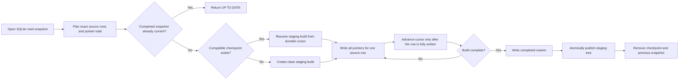

# Resumable navigation views

FireXCore MailVault navigation views are disposable JSON pointer trees derived from the canonical SQLite index and immutable object store. They make large archives easier to browse by sender domain, thread, year, mailbox, and Gmail label without duplicating raw EML or attachment bytes.

Version 2.0.6 replaces the original one-shot view exporter with a Windows-safe, resumable, observable build pipeline.

<p align="center">
  
</p>

## What changed in 2.0.6

| Change | Previous behavior | Version 2.0.6 behavior |
|---|---|---|
| Path safety | Long attachment names could produce paths that exceeded Windows limits. | Directory segments and pointer filenames are bounded and collision-resistant; atomic temporary filenames use a short constant prefix. |
| Interruption handling | `Ctrl+C` discarded all partial work on the next run. | Fully completed source rows are checkpointed and the same command resumes from the durable cursor. |
| Progress visibility | The command displayed output only after the entire build completed. | Planning, building, resuming, publishing, exact row counts, pointer counts, percentage, and ETA are displayed live. |

These changes affect only the derived `views/` layer. Raw EML objects, content-addressed blobs, SQLite records, manifests, reports, and evidence files are not rewritten by `mailvault views`.

## View model

Each pointer is a small JSON document that references canonical archive objects. A pointer may include:

- canonical message archive ID;
- provider thread identity;
- subject;
- raw EML path;
- MIME part ID and path;
- original attachment filename;
- SHA-256 digest;
- blob path;
- detected MIME type and size.

The original attachment filename remains inside pointer JSON for evidence and inspection. It is not trusted as an unbounded filesystem filename.

The published tree contains:

```text
views/
├── _mailvault_views.json
├── by-domain/<domain>/<sender>/<year>/<pointer>.json
├── by-thread/<thread>/<pointer>.json
├── by-year/<year>/<pointer>.json
├── by-mailbox/<mailbox>/<pointer>.json
└── by-label/<label>/<pointer>.json
```

The `_mailvault_views.json` marker identifies the completed layout version, source fingerprint, row count, pointer count, per-view counts, and completion timestamp.

## Build lifecycle



## Durable state

An incomplete build uses these paths:

```text
state/views-rebuild-v1.json
state/views-rebuild-staging-v3/
```

During publication, the previous completed snapshot can temporarily move to:

```text
state/views-previous/
```

The checkpoint records:

- state schema version;
- view layout version;
- source fingerprint;
- total source rows;
- total pointer writes;
- completed source rows;
- completed pointer writes;
- per-view counters;
- durable cursor;
- build phase;
- start and update timestamps.

The durable cursor consists of:

```text
message_id
part_path
part_id
```

MailVault advances that cursor only after all pointer files for the current source row have been written successfully. A process interruption can therefore repeat a small number of idempotent writes, but it cannot skip a partially written source row.

## Checkpoint policy

A checkpoint is persisted when either condition is met:

- 250 additional source rows have completed; or
- two seconds have elapsed since the previous checkpoint.

A final checkpoint is also written when the process receives `Ctrl+C` or another exception while building.

## Exact planning and progress

Before writing pointers, MailVault scans the source rows once to calculate:

- the exact number of source rows;
- the exact number of pointer writes;
- a deterministic source fingerprint.

The CLI then reports the active phase:

```text
Planning view snapshot · 12,000 rows
Building views · 87,500/290,314 pointers
Resuming views · 141,250/290,314 pointers
Publishing completed view snapshot…
Views already current
```

The progress bar uses completed source rows as its determinate unit and includes:

- completed and total source rows;
- percentage;
- estimated time remaining;
- exact completed and total pointer writes in the task description.

<p align="center">
  
</p>

## Normal operation

Build views:

```powershell
mailvault views `
  --destination "E:\MailVault-E"
```

A successful first build returns:

```text
Status         REBUILT
Source rows    <count>
Pointer writes <count>
```

Run the same command again without changing the archive. MailVault validates the completed marker and source fingerprint, then returns:

```text
Status         UP TO DATE
```

No pointer files are rewritten in the up-to-date case.

## Safe interruption and resume

Stop an active build with `Ctrl+C`. MailVault writes the latest durable checkpoint and reports the completed row position.

Resume by running the identical command:

```powershell
mailvault views `
  --destination "E:\MailVault-E"
```

The active task begins with `Resuming views`, and the final result reports:

```text
Status         RESUMED
```

Do not delete the checkpoint or staging directory when the goal is to resume.

## Intentional restart

Use `--restart` only when the incomplete staging build should be discarded deliberately:

```powershell
mailvault views `
  --destination "E:\MailVault-E" `
  --restart
```

This removes only the incomplete checkpoint and staging tree. It does not remove canonical archive data. The previous completed `views/` snapshot remains available until the replacement has been built and published.

## Source changes during an interrupted build

The checkpoint is accepted only when its source fingerprint, layout version, row count, and pointer count match the newly planned snapshot.

If the SQLite source changed after interruption, MailVault automatically rejects the stale checkpoint and starts a clean replacement build. This prevents a resumed view tree from combining rows from two different archive states.

## Transactional publication

MailVault never publishes the staging directory incrementally as the active `views/` tree.

At completion:

1. the staging tree receives its completed marker;
2. the current `views/` tree is moved to `state/views-previous/`;
3. the completed staging tree is moved into `views/`;
4. the previous tree is removed only after successful publication.

If publication fails, MailVault restores the previous completed tree. Startup recovery also detects and repairs an interrupted publication sequence.

## Windows path safety

Version 2.0.6 applies three independent controls:

1. View directory segments are sanitized and limited to 64 characters. Values that exceed the limit receive a deterministic 16-character SHA-256 suffix.
2. Pointer filenames are derived from canonical archive identity, MIME part identity, and a deterministic hash rather than the complete attachment filename.
3. Atomic temporary files use a short `.mv-` prefix instead of embedding the destination filename in the temporary filename.

This design preserves human-recognizable path prefixes while preventing untrusted mailbox labels, sender addresses, thread identifiers, or attachment names from creating unbounded paths.

## Process locking

`mailvault views` acquires the same archive process lock used by synchronization. A view build and a sync cannot mutate the same archive concurrently. The source is read inside a protected SQLite transaction, so the plan and build operate against one consistent snapshot.

## Operational inspection

Check for an incomplete build:

```powershell
Test-Path "E:\MailVault-E\state\views-rebuild-v1.json"
Test-Path "E:\MailVault-E\state\views-rebuild-staging-v3"
```

After successful publication, both should return `False`.

Check the completed marker:

```powershell
Test-Path "E:\MailVault-E\views\_mailvault_views.json"
```

It should return `True`.

Check for temporary files left after completion:

```powershell
Get-ChildItem `
  "E:\MailVault-E\views" `
  -File `
  -Recurse `
  -Filter "*.tmp"
```

The command should produce no output.

Count published pointer files:

```powershell
(Get-ChildItem "E:\MailVault-E\views" -File -Recurse).Count
```

The count includes `_mailvault_views.json`; the result table reports pointer writes separately.

## Result statuses

| Status | Meaning |
|---|---|
| `REBUILT` | A clean replacement snapshot was built and published. |
| `RESUMED` | A compatible incomplete build resumed and was published. |
| `UP TO DATE` | The existing completed snapshot already matches the current source fingerprint. |

## Failure handling

| Symptom | Required action |
|---|---|
| Build stopped with `Ctrl+C` | Run the same command to resume. |
| Build restarts from zero after interruption | The source changed, the layout version changed, the checkpoint was missing, or `--restart` was used. |
| Failure mentions an old attachment filename and a path longer than Windows accepts | Upgrade to 2.0.6 or newer; older exporters used unbounded derived filenames. |
| Progress remains in planning | Planning must scan the complete source once to calculate exact totals and the fingerprint. Wait for `View plan ready`. |
| Command reports `UP TO DATE` | No action is required; the existing snapshot is current. |
| Completed marker is missing | The view tree is not a completed published snapshot. Rerun `mailvault views`. |

## Validation

The implementation is covered by tests for:

- concise deterministic pointer filenames;
- collision-resistant bounded path segments;
- short atomic temporary filenames;
- interruption at a fully completed source-row boundary;
- automatic resume from the durable cursor;
- stale-checkpoint rejection after a source change;
- no-op behavior for a current completed snapshot;
- exact source-row and pointer totals;
- preservation of the previous completed tree during rebuild.

Run the targeted tests:

```powershell
python -m pytest `
  tests\test_view_exporter.py `
  tests\test_unicode_safety.py `
  -q
```

Run the complete release quality gate:

```powershell
python scripts\quality.py
```

The quality gate covers Ruff, formatting, strict mypy, pytest with coverage, release metadata, wheel and source builds, Twine validation, clean-wheel installation, and CLI smoke checks.

## Compatibility

An interrupted build created by a version before 2.0.6 has no compatible durable view checkpoint. The first 2.0.6 view build starts from row zero. Every interruption created by 2.0.6 or a compatible later layout is resumable.

No database migration is required. The change is isolated to derived view filenames, build-state files, progress reporting, and publication behavior.
