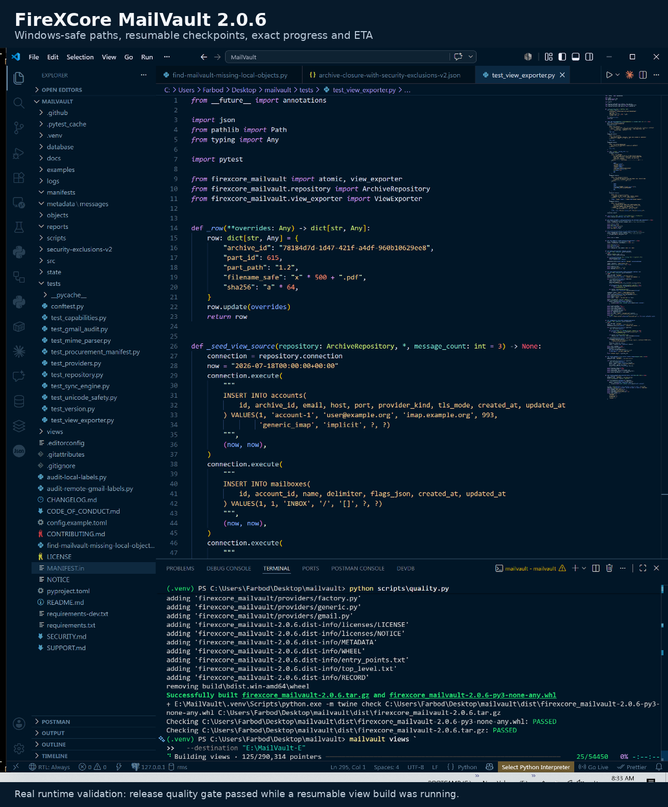

# FireXCore MailVault 2.0.6

## Windows-safe, resumable and observable navigation views

Version 2.0.6 hardens the disposable navigation-view layer for large production archives. It addresses three operational failures found during a real archive build:

1. unbounded derived filenames could exceed Windows path limits;
2. interrupted view builds restarted from zero;
3. long-running view builds had no determinate progress or ETA.

<p align="center">
  
</p>

## Added

- Durable source-row checkpoints for view builds.
- Automatic resume after `Ctrl+C` or a recoverable build interruption.
- Exact planning of source rows and pointer writes.
- Determinate progress, percentage and estimated time remaining.
- Explicit planning, building, resuming, publishing and up-to-date phases.
- `mailvault views --restart` for deliberate checkpoint invalidation.
- Completed snapshot marker `_mailvault_views.json`.
- Source fingerprints that make unchanged builds return `UP TO DATE`.

## Fixed

- Bounded view directory segments with deterministic SHA-256 suffixes.
- Concise pointer filenames independent of full attachment-name length.
- Short `.mv-` atomic temporary-file prefixes.
- Transactional publication that preserves the previous completed view tree until the replacement is complete.
- Recovery from an interrupted publish sequence.
- Accurate per-view pointer counters.

## Safety properties

- Canonical raw EML and blob objects are not rewritten.
- The SQLite archive schema is unchanged.
- The source is read inside a consistent transaction.
- Synchronization and view builds cannot run concurrently against the same archive.
- A checkpoint advances only after every pointer for one source row is written.
- A changed source fingerprint automatically invalidates stale incomplete state.
- The previous completed view tree remains available throughout the replacement build.

## Upgrade

Install the current checkout:

```powershell
python -m pip install -e ".[dev]"
```

Verify:

```powershell
mailvault version
python -m firexcore_mailvault version
```

Both commands must report `2.0.6`.

Build views:

```powershell
mailvault views `
  --destination "E:\MailVault-E"
```

An incomplete build from a version before 2.0.6 starts from zero because no compatible view checkpoint exists. Interruptions created by 2.0.6 resume automatically when the same command is rerun.

## Verification

```powershell
python -m pytest `
  tests\test_view_exporter.py `
  tests\test_unicode_safety.py `
  -q

python scripts\quality.py
```

After a successful real build:

```powershell
Test-Path "E:\MailVault-E\state\views-rebuild-v1.json"
Test-Path "E:\MailVault-E\state\views-rebuild-staging-v3"
Test-Path "E:\MailVault-E\views\_mailvault_views.json"
```

Expected:

```text
False
False
True
```

Temporary-file check:

```powershell
Get-ChildItem `
  "E:\MailVault-E\views" `
  -File `
  -Recurse `
  -Filter "*.tmp"
```

Expected: no output.

## Documentation

- [Resumable navigation views](../RESUMABLE_VIEWS.md)
- [CLI reference](../CLI_REFERENCE.md#mailvault-views)
- [Operations](../OPERATIONS.md#derived-output-recovery)
- [Troubleshooting](../TROUBLESHOOTING.md)
